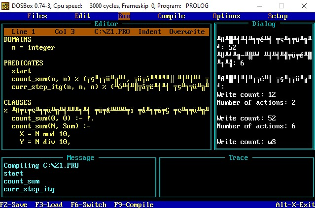
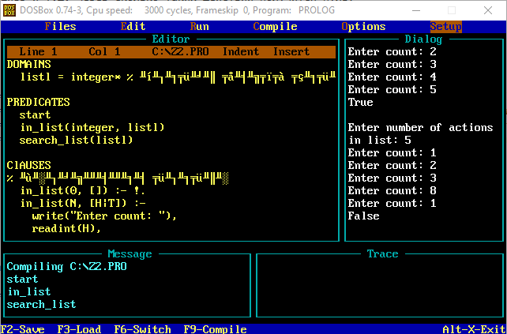
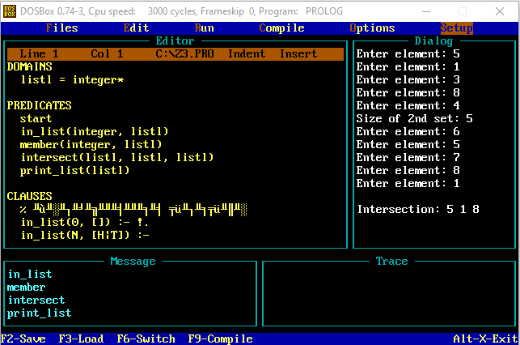

# Мартелов Елисей Группа ИТС1 Лабораторная №5

## Задание 1

### Задача 1

### Текст задачи

#### Из заданного числа вычли сумму его цифр. Из результата вновь вычли сумму его цифр и т.д. Через сколько таких действий получится нуль?

### Алгоритм решения

#### DOMAINS- объявлет что будем использовать(Объявление типов данных)  	PREDICATES- предикаты(отношения)(объявляем в каких функциях мы будем это использовать) 	CLAUSES- здесь пишется основной код всей программы	GOAL- начало программы(точка входа как main), после чего ищет start :-
#### Берёт число(например 12) и считает его сумму цифр(1+2=3). Затем вычитает эту сумму из числа(12-3=9) и считает сколько раз так сделал. Повторяется до тех пор пока не получится 0 и выводит количество шагов.
#### В count_sum происходит рекурсия вглубь. Разбивается число на цифры через mod(остаток от деления), div(целочисленное деление). Z - с самого начала не известно, чтобы его найти рекурсия проходит до знака стоп-cut(отсечение)(!.) и понимает что Z = 0, и при возврате в Z будет записываться сумма числа.\
#### В хвостовой рекурсии(curr_step_itg) вызывается count_sum, для вычисления суммы и записи разности текущего числа и его суммы(CurrentN - S) в его новое число NewN. Дальше подсчёт текущего шага(NextSteps = CurrentSteps+1). Вызов это же рекурсии с новыми значениями(NewN, NextSteps, Total). Total - используется когда число доходит до 0 и срабатывает правило curr_step_itg(0, Steps, Steps). В этот момент накопленное значение записывается в Total и возвращается пользователю.

### Тестирование

##### 

### Задача 2

### Текст задачи

#### Выяснить, упорядочены ли элементы списка по возрастанию. 

### Алгоритм решения

#### Объявление типов данных: listl будет равен целочисленным числам со ссылкой(в коде адресс не передаётся, а передаётся сама структура, ProLog сам определяет как прокинуть по памяти).	Объявляются предикты: in_list(длина списка, указание на список) - для ввода списка, search_list(указание на список) - для проверки списка
#### В основной части - CLAUSES - происходит заполнение списка посредством рекурсии, вводится число H(readint(H), затем вычитание единицы из общей длинны(N1 = N - 1). Вызов рекурсии с новыми параметрами(in_list(N1, T)), при этом в [H|T] происходит создание нового списка T, то есть H - голова, T - хвост.
#### В проверке списка на возрастание(search_list) описаны пустые списки, которые считаются упорядоченными. Дальше берутся первые два элемента X и Y, остальные элементы оказываются в Tail. После чего они сравниваются и если проверка прошла, идёт дальше. В рекурсию передаёт следующую цифру [1, 2, 3] сначала проверил 1 и 2, затем 2 и 3.

### Тестирование

### Задача 3

### Текст задачи

#### Определим множество как список без повторяющихся элементов. Найти пересечение множеств. 

### Алгоритм решения

#### При запуске кода вводится длинна 1го списка и сразу заполняется, потом 2ая длинна и сразу заполняется второй список(in_list). Заполнение списка рекурсивным путём, добавлнение элемента в голову, отнимание 1цы от общей длинны(N1 = N-1) и повторный вызов этой функции (in_list(N1, T)). Затем происходит вызов для поиска пересечения(intersect(L1, L2, Result)).
#
#### При запуске intersect - первыйм делом проверяется не пустой ли список(intersect([], _, []).), затем запуск функции(member(H, L2) с первыйм элементом первого списка и всеми элементами второго списка). В ней происходит сравнение элементов и если он нашёл подходящий, то рекурсия возвращает его и ожидает завершения рекурсивного вызова для хвоста Res. Если member(H,L2) вернёт False, то запуститься третье правило, в нём текущая голова игнорируется(_|Т), а в результат передастся только то что уже там было. 
#### Так же если в member(H, L2), !, убрать(!), то программа может выдать неправильный результат. То есть при возврате из глубины программа использует третье правлио и в результате появятся не полные пересечения.
#
#### В конце программы проиходит рекурсивный вывод результата(print_list). Он выводит голову(H), повторный запуск этой функции с указанием на хвост(T), то есть второй элемент становится первым(H).

### Тестирование

